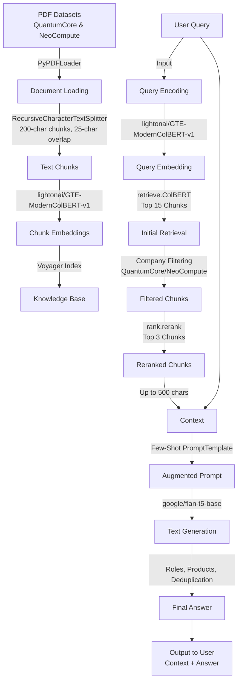

# Retrieval-Augmented Generation (RAG) Pipeline Demo

This project implements a minimal Retrieval-Augmented Generation (RAG) pipeline designed for a take-home interview project. The pipeline answers user queries by leveraging content from two PDF datasets: `QuantumCore_Solutions_RAG_Demo_Dataset_v1.pdf` and `NeoCompute_Technologies_RAG_Demo_Dataset_v2.pdf`. It uses lightweight, CPU-friendly models to ensure compatibility with environments like Google Colab.

## Objective

The RAG pipeline combines retrieval and generative AI to provide accurate, context-grounded answers from PDF content. It supports queries about leadership roles, product lists, technical specifications, and compliance standards, with features like company-specific filtering and post-processing for clean outputs.

## Features

- **Efficient Models**: Uses `lightonai/GTE-ModernColBERT-v1` for embeddings and `google/flan-t5-base` for text generation, optimized for CPU environments.
- **Document Processing**: Loads and splits PDFs into 200-character chunks with 25-character overlap using `PyPDFLoader` and `RecursiveCharacterTextSplitter`.
- **Retrieval and Reranking**: Retrieves top 15 relevant chunks using `retrieve.ColBERT`, then reranks to top 3 using `rank.rerank` for improved relevance.
- **Few-Shot Prompting**: Employs a `PromptTemplate` with fictional examples to guide answer extraction for roles, products, and specifications.
- **Company Filtering**: Filters retrieved chunks by company (QuantumCore or NeoCompute) based on query keywords.
- **Interactive Interface**: Provides a user-friendly query interface in Google Colab to test the pipeline with custom or example queries.

## Architecture

The pipeline follows a modular RAG design:
1. **Knowledge Base**: PDFs are processed into chunks, stored with unique IDs, and tracked by source (company) for filtering.
2. **Semantic Layer**: Text chunks and queries are embedded into dense vectors using `lightonai/GTE-ModernColBERT-v1`.
3. **Retrieval System**: Fetches top 15 chunks, reranks to top 3, and filters by company if specified.
4. **Augmentation**: Combines top 3 chunks (up to 500 characters) with the query using a Few-Shot `PromptTemplate`.
5. **Generation**: Uses `google/flan-t5-base` to generate concise answers, with post-processing for roles and product lists.

## Pipeline Architecture Diagram

Below is a flowchart illustrating the RAG pipeline's workflow.



## Requirements

- Python 3.10+
- Google Colab (recommended) or local environment with CPU
- Required libraries:
  - `pylate`
  - `langchain`
  - `transformers`
  - `google-colab`
  - `langchain-community`
  - `pypdf`
  - `hf_xet`

## Setup Instructions

1. **Clone or Download the Notebook**:
   - Obtain the `rag_pipeline_notebook_mg_v1.ipynb` file.

2. **Install Dependencies**:
   - Run the following commands in your environment (or use Cell 1 in the notebook):
     ```bash
     pip install pylate langchain transformers google-colab
     pip install -U langchain-community pypdf hf_xet
     ```

3. **Prepare PDF Datasets**:

   - Place the PDF files (`QuantumCore_Solutions_RAG_Demo_Dataset_v1.pdf` and `NeoCompute_Technologies_RAG_Demo_Dataset_v2.pdf`) in the `/data` directory.
   - If running in Google Colab, the notebook will prompt you to upload the PDFs if they are not found.

4. **Run the Notebook**:
   - Open `rag_pipeline_notebook_mg_v1.ipynb` in Google Colab or a Jupyter environment.
   - Execute the cells in order:
     - **Cell 1**: Install dependencies.
     - **Cell 2**: Import libraries and suppress warnings.
     - **Cell 3**: Define the RAG pipeline functions.
     - **Cell 4**: Process PDFs and initialize the pipeline.
     - **Cell 5/6**: Run the interactive query interface.

## Usage

1. **Initialize the Pipeline**:
   - Run Cells 1–4 to install dependencies, import libraries, define the pipeline, and process the PDFs.
   - Ensure the PDFs are available in the `/data` directory or upload them when prompted in Colab.

2. **Query the System**:
   - Run Cell 5 or 6 to start the interactive query interface.
   - Enter a query or use one of the example queries provided.
   - Type `exit` to quit the interface.

3. **Example Queries**:
   - **Who is the CEO of QuantumCore Solutions?** → Expected: `Dr. Elena Ruiz`
   - **What are the products offered by NeoCompute Technologies?** → Expected: `NeoCloud, NeoSecure`
   - **Who is the CIO of NeoCompute Technologies?** → Expected: `The answer could not be found in the text.`
   - **What is the qubit count of QubitCore?** → Expected: `50-qubit superconducting architecture`
   - **What compliance standards does NeoCompute follow?** → Expected: `ISO/IEC 27001, SOC 2 Type II`

## Output Format

For each query, the system displays:
- **Query**: The user's input.
- **Context Retrieved**: The top 3 relevant text chunks (up to 500 characters) used to generate the answer.
- **Answer**: The generated response, formatted according to the query type (e.g., full name for roles, comma-separated list for products).

## Notes

- **Environment**: Designed for Google Colab with CPU, but can be adapted for local environments.
- **Error Handling**: The pipeline includes robust error handling for missing PDFs, empty retrievals, or model failures.
- **Limitations**: Assumes the PDFs contain relevant information. If a query cannot be answered, it returns: `The answer could not be found in the text.`
- **Customization**: Modify the `chunk_size` (200) or `chunk_overlap` (25) in Cell 3 for different document splitting behaviors.

## Troubleshooting

- **PDF Not Found**: Ensure PDFs are in the `/data` directory or upload them when prompted in Colab.
- **Pipeline Initialization Failure**: Check that all dependencies are installed and PDFs contain valid content.
- **No Relevant Documents**: Verify query keywords (e.g., "QuantumCore" or "NeoCompute") match the PDF content.


## License

This project is for demonstration purposes as part of a take-home interview assignment. Ensure compliance with any licensing requirements for the datasets and models used.
